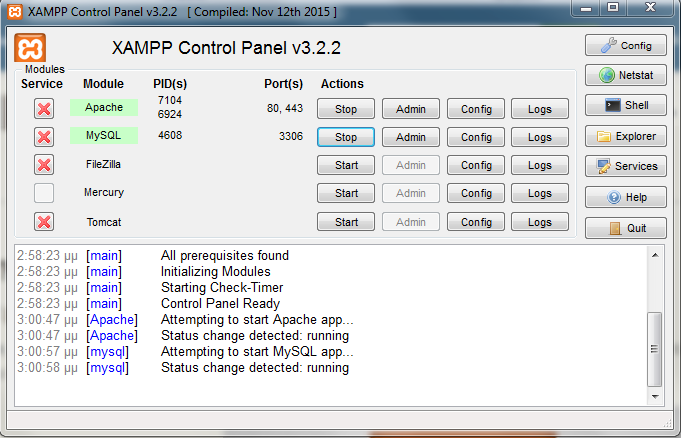
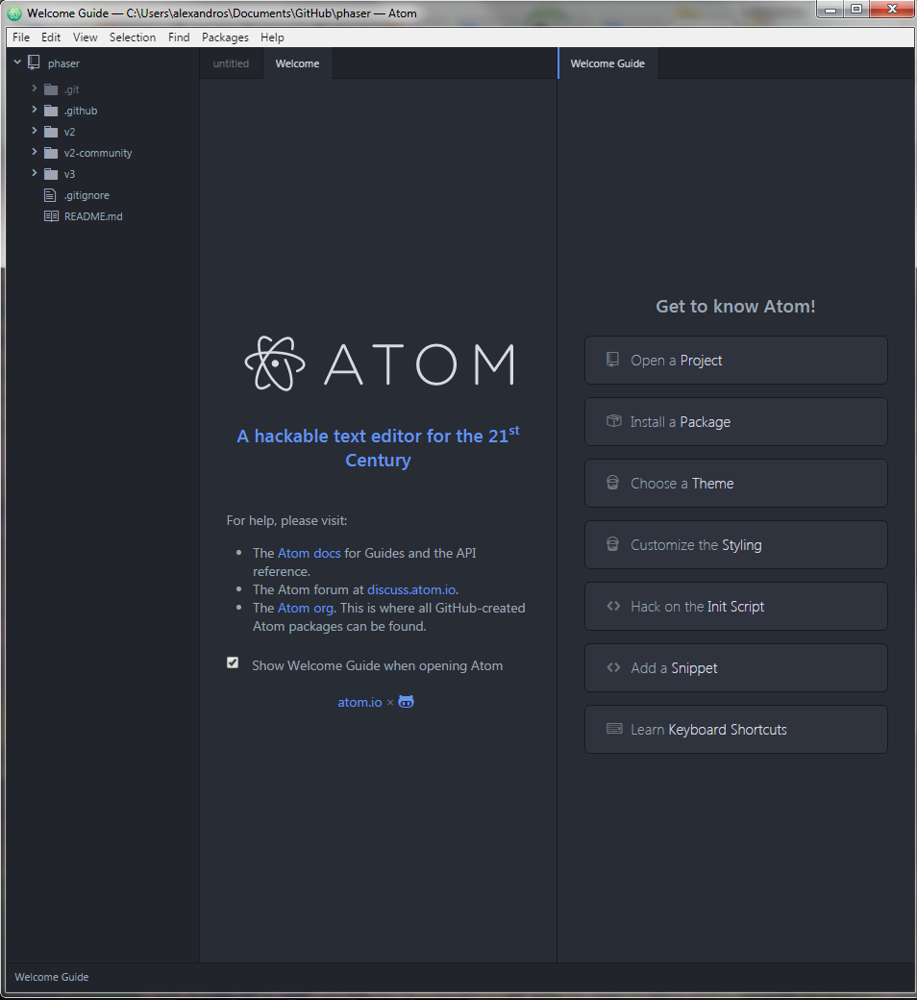
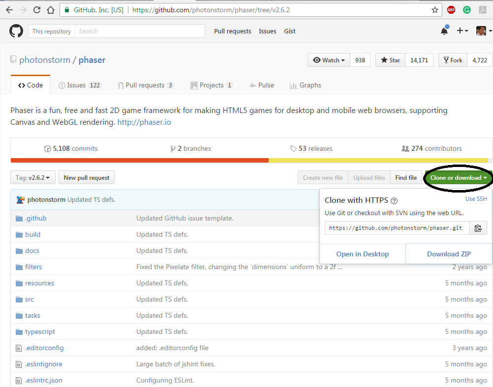

# Δημιουργία HTML5 παιχνίδιου με χρήση του Phaser

To [Phaser](http://phaser.io/) είναι  μια πλατφόρμα για την ανάπτυξη παιχνιδιών μέσω HTML5. Σκοπός της εργασίας είναι να δημιουργήσεις το δικό σου HTML5 video game. 
 
Στο site του [Phaser](http://phaser.io/) μπορείς να βρεις διάφορα [tutorial](http://phaser.io/learn) και [παραδείγματα](http://phaser.io/examples).
 
Για την ανάπτυξη του παιχνίδιου μπορείς να χρησιμοποιήσεις είτε το [jsbin](http://jsbin.com/?js,output) ή το [codepen](http://codepen.io/). Θα πρότεινα να χρησιμοποιήσεις το jsbin και να κάνετε sign-in χρησιμοποιώντας τον github λογαριασμό σου. Με το jsbin μπορείς να επεξεργαστείς και να εκτελέσεις online τον κώδικα του παιχνιδιού σου.
 
Ο προγραμματισμός στο Phaser γίνεται σε JavaScript (δες [tutorial](http://www.w3schools.com/js/)).

Μελέτησε τα επίσημα [tutorials](https://phaser.io/learn/official-tutorials) του Phaser για να πάρεις ιδέες για το παιχνίδι σου.

## Διαδικασία 

Για την εργασία θα στηριχθείς σε ένα υπάρχον παιχνίδι το pacman (σε [jsbin](http://jsbin.com/behola/1/edit?js,output) ή [codepen](http://codepen.io/photonstorm/pen/emeRJW?editors=001)) και στη συνέχεια θα πρέπει να το επεκτείνεις. Αναλυτικές αρχικές οδηγίες θα βρεις [εδώ](https://phaser.io/tutorials/coding-tips-005).

Αρχικά θα πρέπει να έχεις δημιουργήσει ένα νέο public repository στο προσωπικό σου github λογαριασμό.

Στο προσωπικό σου github repository θα πρέπει να βρίσκεται ο κώδικας του παιχνιδίου (.html) καθώς και ο φάκελος assets με τα αντικείμενα (πίστες, εικόνες, ήχοι) που θα χρησιμοποιήσεις στο παιχνίδι σου.

Το βασικό πρόβλημα τόσο στο jsbin όσο και στο codepen είναι ότι το ανέβασμα assets (πίστες, εικόνες, ήχοι) είναι επί πληρωμή. Για να ξεπεράσουμε το συγκεκριμένο πρόβλημα θα χρησιμοποιήσουμε τα github pages για την αποθήκευση των απαραίτητων assets.

Αρχικά δημιούργησε ένα νέο φάκελο assets και ανέβασε εκεί μια εικόνα (ball.png).

 
Στη συνέχεια στα setting του repository ενεργοποίησε το Github Pages.

Τέλος φόρτωσε την εικόνα από το Github Pages στο jsbin.

## Παραδοτέο 1 Δημιουργία νέας πίστας

- Δημιούργησε μια νέα πίστα για το παιχνίδι  χρησιμοποιώντας το [Tiled](http://www.mapeditor.org/). 
- Αντί για τον Pacman χρησιμοποίησε έναν άλλο χαρακτήρα για πρωταγωνιστή του παιχνιδιού. 

## Παραδοτέο 2: Πρόσθεσε ήχους, επιπλέον αντικείμενα
- Αντί ο πρωταγωνιστής να μαζεύει μόνο dots θα μπορούσε να μαζεύει διάφορα αντικείμενα αντικείμενα (κέρματα, λουλούδια, φρούτα κτλ). 
- Κάποια από αυτά μπορούν να εμφανίζονται ξαφνικά σε κάποιο τυχαίο σημείο της πίστας και μετά από κάποιο χρονικό διάστημα να εξαφανίζονται.
- Πρόσθεσε τους κατάλληλους ήχους.

## Παραδοτέο 3: Πρόσθεσε score, bonus και ζωές

- Επέκτεινε κατάλληλα το παιχνίδι ώστε να προσθέσεις score, bonus και ζωές. 

## Παραδοτέο 4: Πρόσθεσε εχθρούς και χρόνο.

- Οι εχθροί θα πρέπει να κινούνται τυχαία στην πίστα ενώ μετά από κάποιο χρονικό διάστημα για να δυσκολέψεις το παιχνίδι θα μπορούσες να αυξάνεις την ταχύτητά τους. 
- Ο πρωταγωνιστής επίσης θα μπορούσε να αντιμετωπίσει τους εχθρούς συλλέγοντας το κατάλληλο αντικείμενο. Είτε θα μπορούσε να έχει τη δυνατότητα να τους τρώει για κάποιο χρονικό διάστημα, είτε θα μπορούσε να του πετάει κάτι από απόσταση και να τους εξολοθρεύει.
- Τέλος θα μπορούσες να κάνεις προσθέσεις δυνατότητα teleport για τον πρωταγωνιστή σε συγκεκριμένα σημεία της πίστας.

 ## Βαθμολόγηση
 - Μικρές αλλαγές στο παιχνίδι όπως περιγράφονται στα παραδοτέα 1 και 2 μέχρι 6. 
 - Επιπλέον αλλαγές όπως περιγράφονται στο παραδοτέο 3 μέχρι 7.
 - Σημαντικές αλλαγές με προσθήκη εχθρών: 8-9.
 - Αν υλοποιηθούν όλες οι προτεινόμενες επεκτάσεις: 10
 
 
 
 

 

 
