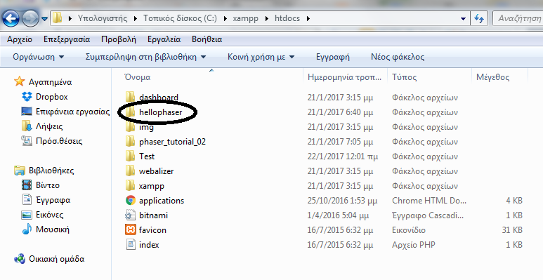
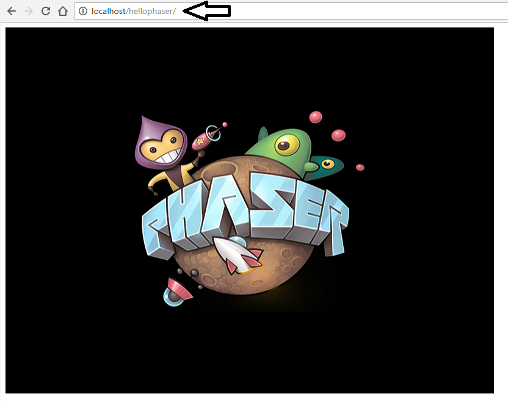
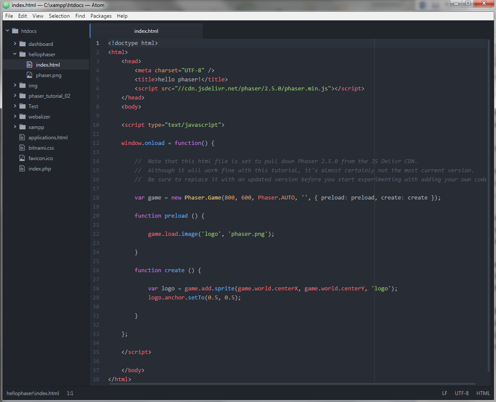

# PHASER HTML5 GAMES

To [Phaser](http://phaser.io/) είναι η μια πλατφόρμα για την ανάπτυξη παιχνιδιών μέσω HTML5. Σκοπός της εργασίας είναι να δημιουργήσεις το δικό σου HTML5 video game. Στο site του [Phaser](http://phaser.io/) μπορείς να βρεις διάφορα [tutorial](https://phaser.io/learn/official-tutorials) και [παραδείγματα](http://phaser.io/examples) για να συμβουλευτείς.
Αρχικά πρέπει να ρυθμίσεις το περιβάλλον ανάπτυξης εφαρμογών(IDE) στο οποίο θα εργαστείς για να δημιουργήσεις το Phaser video game σου. Μπορείς να ακολουθήσεις τις [οδηγίες](http://phaser.io/tutorials/getting-started) που υπάρχουν στο site του Phaser ή εναλλακτικά να ακολουθήσεις την παρακάτω διαδικασία.

Συνοπτικά τα βήματα που θα πρέπει να ακολουθήσεις είναι:

1. Kάνε εγκατάσταση έναν web server. Οι προτεινόμενοι είναι ο [WAMP Server](http://www.wampserver.com/en/) ή ο [XAMPP](https://www.apachefriends.org/index.html). Εγώ έκανα εγκατάσταση τον [XAMPP](https://www.apachefriends.org/index.html).

2. Αφού τον εγκαταστήσεις ξεκίνα το Apache και ΜySQL apps.

3. Κάνε εγκατάσταση ένα [συντάκτη](http://phaser.io/tutorials/getting-started/part4) στον οποίο θα γράψεις το πρόγραμμα σου. Για ευκολία θα πρότεινα τον open source [Atom](https://atom.io/). Για πιο προχωρημένους θα μπορούσε να γίνει χρήση του [Eclipse](http://www.html5gamedevs.com/topic/22688-setting-up-eclipse-to-work-with-phaser-how-to/).

4. Κατέβασε το Phaser από [εδώ](http://phaser.io/download/stable). Εγώ επέλεξα να κάνω clone για να κατεβάσω όλο το repository στον υπολογιστή μου ωστόσο υπάρχει η δυνατότητα να κατεβάσεις το Phaser και σαν zip αρχείο. 

5. Αφού κατεβάσεις το Phaser κάνε copy το φάκελο hellophaser (phaser\v2\resources\tutorials\01 Getting Started\) και paste μέσα στο φάκελο C:\xampp\htdocs\.

6. Άνοιξε τον browser σου και στη διεύθυνση πληκτρολόγησε localhost/hellophaser για να δεις μια απλή Phaser εφαρμογή (προσοχή πρέπει να έχεις ξεκινήσει τον web server δες βήμα 2 παραπάνω).

7. Αν θες να επεξεργαστείς τη συγκεκριμένη εφαρμογή άνοιξε τη στο συντάκτη.

8. Για να δημιουργήσεις το πρώτο σου Phaser παιχνίδι μπορείς να ακολουθήσεις τις οδηγίες από [εδώ](http://phaser.io/tutorials/making-your-first-phaser-game). Αποσυμπίεσε το phaser_tutorial_02.zip (phaser\v2\resources\tutorials\02 Making your first game\) μέσα στο φάκελο C:\xampp\htdocs\ και πληκτρολογώντας τις κατάλληλες διευθύνσεις (localhost/part1, localhost/part2…) θα βλέπεις στον browser σου τις διάφορες φάσεις ανάπτυξης του παιχνιδιού.

9. Επιπλέον υλικό με παραδείγματα μπορείς να βρεις [εδώ](http://phaser.io/examples). Μπορείς να κάνεις clone όλο το [repository](https://github.com/photonstorm/phaser-examples) με τα παραδείγματα του Phaser ώστε να τα έχεις τοπικά στον υπολογιστή σας ή να τα ανοίγεις και να τα εκτελείς απ’ απευθείας από τη σελίδα του Phaser.

Ο προγραμματισμός στο Phaser γίνεται σε JavaScript (δες [tutorial](http://www.w3schools.com/js/)).

Για την εργασία μπορείς αρχικά να στηριχθείς σε ένα [υπάρχον παιχνίδι](https://phaser.io/tutorials/coding-tips-005) και στη συνέχεια να το επεκτείνεις.

## Βαθμολόγηση για Phaser html5 games
- Μικρές αλλαγές σε υπάρχον παιχνίδι μέχρι 6. 
- Σημαντικές αλλαγές και επεκτάσεις σε υπάρχον παιχνίδι: 7 - 8.
- Ένα πραγματικά πρωτότυπο παιχνίδι: 9-10

